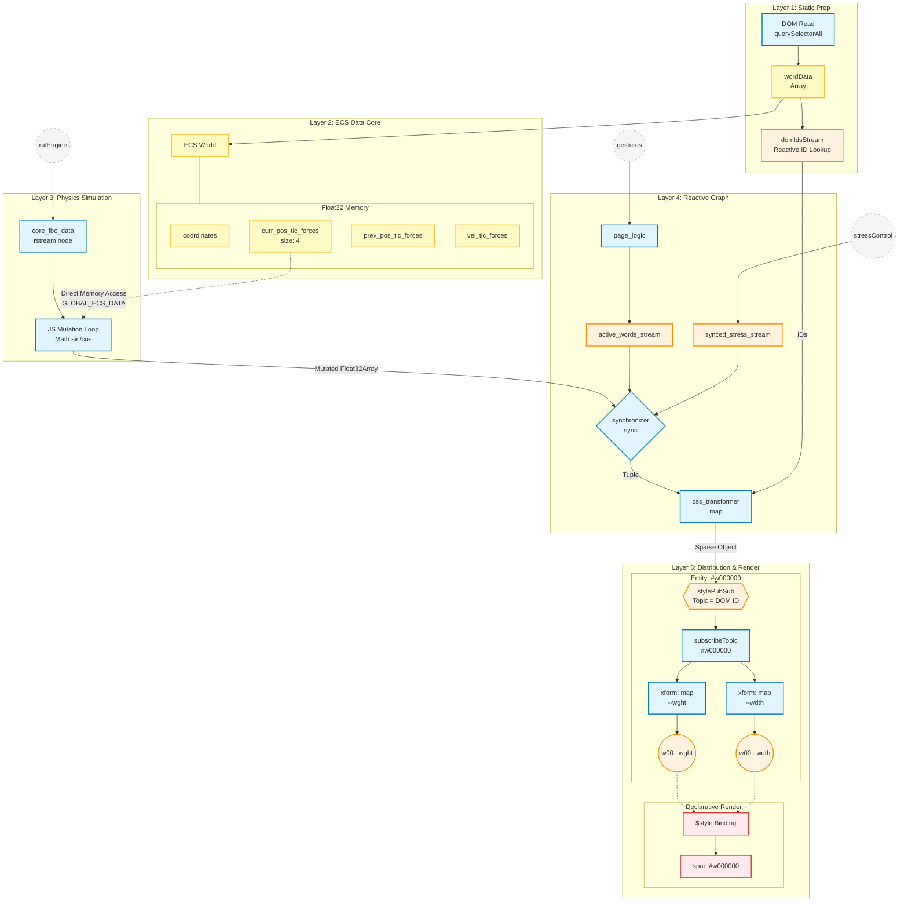

```mermaid
graph TD
    %% ---------------------------------------------------------
    %% STYLES
    %% ---------------------------------------------------------
    classDef storage fill:#fff9c4,stroke:#fbc02d,stroke-width:2px,color:#333;
    classDef logic fill:#e1f5fe,stroke:#0277bd,stroke-width:2px,color:#333;
    classDef stream fill:#fff3e0,stroke:#fb8c00,stroke-width:2px,color:#333;
    classDef dom fill:#ffebee,stroke:#e53935,stroke-width:2px,color:#333;
    classDef ext fill:#f5f5f5,stroke:#999,stroke-dasharray: 5 5,color:#333;
    %% ---------------------------------------------------------
    %% EXTERNAL INPUTS
    %% ---------------------------------------------------------
    RAF((rafEngine)):::ext
    Gestures((gestures)):::ext
    Stress((stressControl)):::ext
    %% ---------------------------------------------------------
    %% LAYER 1: Initialization
    %% ---------------------------------------------------------
    subgraph L1 [Layer 1: Static Prep]
        DOM_Scan[DOM Read\nquerySelectorAll]:::logic
        WordData[wordData\nArray<id, rect>]:::storage
        DomIdsStream[domIdsStream\nReactive ID Lookup]:::stream
    end

    DOM_Scan --> WordData
    WordData --> DomIdsStream
    %% ---------------------------------------------------------
    %% LAYER 2: ECS Data Core
    %% ---------------------------------------------------------
    subgraph L2 [Layer 2: ECS Data Core]
        ECS_World[ECS World]:::storage

        subgraph Components [Float32 Memory]
            direction LR
            Coords[coordinates]:::storage
            TicForces[curr_pos_tic_forces\nsize: 4]:::storage
            PrevTic[prev_pos_tic_forces]:::storage
            VelTic[vel_tic_forces]:::storage
        end
    end

    WordData --> ECS_World
    ECS_World --- Components
    %% ---------------------------------------------------------
    %% LAYER 3: Simulation Loop
    %% ---------------------------------------------------------
    subgraph L3 [Layer 3: Physics Simulation]
        Core_FBO[core_fbo_data\nrstream node]:::logic
        Sim_Logic[JS Mutation Loop\nMath.sin/cos]:::logic
    end

    RAF --> Core_FBO
    Core_FBO --> Sim_Logic
    TicForces -.->|Direct Memory Access\nGLOBAL_ECS_DATA| Sim_Logic
    Sim_Logic -->|Mutated Float32Array| Synchronizer
    %% ---------------------------------------------------------
    %% LAYER 4: Reactive Data Flow
    %% ---------------------------------------------------------

    subgraph L4 [Layer 4: Reactive Graph]
        PageLogic[page_logic]:::logic
        ActiveWords[active_words_stream]:::stream
        SyncedStress[synced_stress_stream]:::stream

        Synchronizer{synchronizer\nsync}:::logic

        Transformer[css_transformer\nmap]:::logic
    end

    Gestures --> PageLogic --> ActiveWords
    Stress --> SyncedStress

    ActiveWords --> Synchronizer
    SyncedStress --> Synchronizer

    Synchronizer -->|Tuple| Transformer
    DomIdsStream -->|IDs| Transformer

    %% ---------------------------------------------------------
    %% LAYER 5: The Declarative Bridge
    %% ---------------------------------------------------------
    subgraph L5 [Layer 5: Distribution & Render]
        %% The Distributor
        PubSub{{stylePubSub\nTopic = DOM ID}}:::stream

        Transformer -->|Sparse Object| PubSub

        %% Example Entity Wiring (Word 0)
        subgraph Entity_w00 [Entity: #w000000]
            direction TB

            %% Subscriptions
            Sub_0[subscribeTopic\n#w000000]:::logic

            %% Transducers extracting specific CSS vars
            Extract_Wght[xform: map\n--wght]:::logic
            Extract_Wdth[xform: map\n--wdth]:::logic

            %% Individual Axis Streams
            Stream_Wght((w00...wght)):::stream
            Stream_Wdth((w00...wdth)):::stream

            %% Wiring
            PubSub --> Sub_0
            Sub_0 --> Extract_Wght --> Stream_Wght
            Sub_0 --> Extract_Wdth --> Stream_Wdth
        end

        %% rdom Integration
        subgraph RDOM [Declarative Render]
            Hiccup_Span[span #w000000]:::dom
            $Style["$style Binding"]:::dom

            Stream_Wght -.-> $Style
            Stream_Wdth -.-> $Style
            $Style --> Hiccup_Span
        end
    end
```
