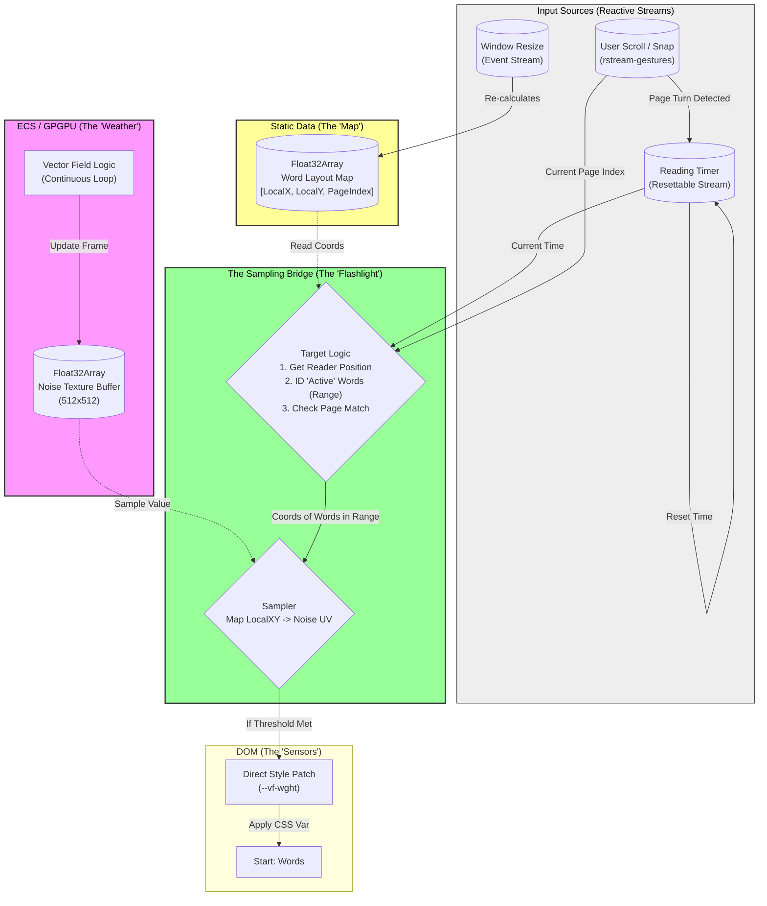

```mermaid
graph TD
    %% --- INPUT LAYER ---
    subgraph Inputs ["Input Sources (Reactive Streams)"]
        Resize[("Window Resize<br>(Event Stream)")]
        User[("User Scroll / Snap<br>(rstream-gestures)")]
        Clock[("Reading Timer<br>(Resettable Stream)")]
    end

    %% --- STATIC DATA LAYER ---
    subgraph Static ["Static Data (The 'Map')"]
        LayoutBuffer[("Float32Array<br>Word Layout Map<br>[LocalX, LocalY, PageIndex]")]
    end

    %% --- GPGPU LAYER ---
    subgraph ECS ["ECS / GPGPU (The 'Weather')"]
        FlowField["Vector Field Logic<br>(Continuous Loop)"]
        NoiseBuffer[("Float32Array<br>Noise Texture Buffer<br>(512x512)")]
    end

    %% --- THE BRIDGE ---
    subgraph Bridge ["The Sampling Bridge (The 'Flashlight')"]
        TargetLogic{"Target Logic<br>1. Get Reader Position<br>2. ID 'Active' Words (Range)<br>3. Check Page Match"}
        Sampler{"Sampler<br>Map LocalXY -> Noise UV"}
    end

    %% --- VIEW LAYER ---
    subgraph View ["DOM (The 'Sensors')"]
        DOMNodes["Start: <span> Words"]
        Update["Direct Style Patch<br>(--vf-wght)"]
    end

    %% --- CONNECTIONS ---

    %% Handling Layout & Resize
    Resize -->|Re-calculates| LayoutBuffer
    LayoutBuffer -.->|Read Coords| TargetLogic

    %% Handling User Progress
    User -->|Page Turn Detected| Clock
    Clock -->|Reset Time| Clock
    Clock -->|Current Time| TargetLogic
    User -->|Current Page Index| TargetLogic

    %% Handling Physics
    FlowField -->|Update Frame| NoiseBuffer
    NoiseBuffer -.->|Sample Value| Sampler

    %% The Core Loop
    TargetLogic -->|Coords of Words in Range| Sampler
    Sampler -->|If Threshold Met| Update
    Update -->|Apply CSS Var| DOMNodes

    %% Styling
    style ECS fill:#f9f,stroke:#333,stroke-width:2px,color:black
    style Static fill:#ff9,stroke:#333,stroke-width:2px,color:black
    style Bridge fill:#9f9,stroke:#333,stroke-width:2px,color:black
    style Inputs fill:#eee,stroke:#333,stroke-width:1px,color:black
```
