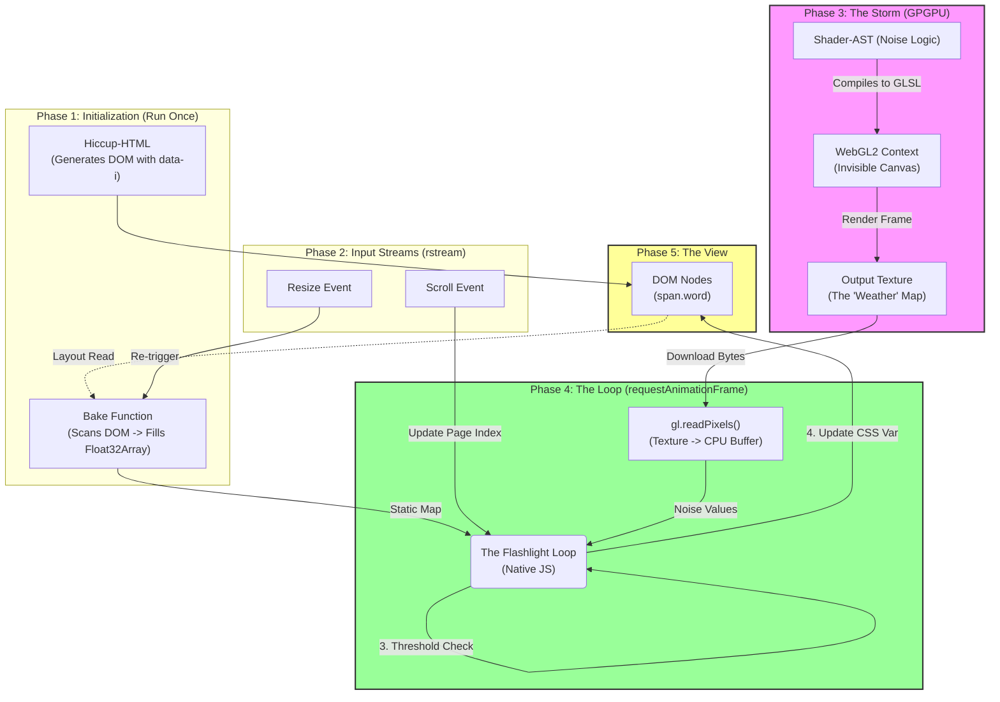

```mermaid
graph TD
    %% --- SECTIONS ---
    subgraph OneTime ["Phase 1: Initialization (Run Once)"]
        Hiccup["Hiccup-HTML<br>(Generates DOM with data-i)"]
        Bake["Bake Function<br>(Scans DOM -> Fills Float32Array)"]
    end

    subgraph Inputs ["Phase 2: Input Streams (rstream)"]
        Scroll["Scroll Event"]
        Resize["Resize Event"]
    end

    subgraph GPU ["Phase 3: The Storm (GPGPU)"]
        ShaderAST["Shader-AST (Noise Logic)"]
        WebGL["WebGL2 Context<br>(Invisible Canvas)"]
        Texture["Output Texture<br>(The 'Weather' Map)"]
    end

    subgraph CPU ["Phase 4: The Loop (requestAnimationFrame)"]
        Loop("The Flashlight Loop<br>(Native JS)")
        ReadBack["gl.readPixels()<br>(Texture -> CPU Buffer)"]
    end

    subgraph Output ["Phase 5: The View"]
        DOMNodes["DOM Nodes<br>(span.word)"]
    end

    %% --- FLOWS ---

    %% Setup
    Hiccup --> DOMNodes
    DOMNodes -.->|Layout Read| Bake
    Bake -->|Static Map| Loop

    %% Inputs
    Resize -->|Re-trigger| Bake
    Scroll -->|Update Page Index| Loop

    %% Physics
    ShaderAST -->|Compiles to GLSL| WebGL
    WebGL -->|Render Frame| Texture
    Texture -->|Download Bytes| ReadBack
    ReadBack -->|Noise Values| Loop

    %% The Render
    Loop -->|1. Lookup Word Pos| Loop
    Loop -->|2. Sample Noise| Loop
    Loop -->|3. Threshold Check| Loop
    Loop -->|4. Update CSS Var| DOMNodes

    %% STYLES
    style GPU fill:#f9f,stroke:#333,stroke-width:2px
    style CPU fill:#9f9,stroke:#333,stroke-width:2px
    style Output fill:#ff9,stroke:#333,stroke-width:2px
```
