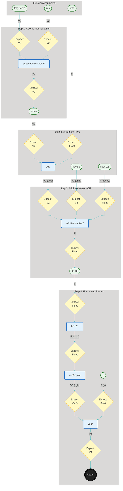

```mermaid
---
config:
  theme: 'base'
  themeVariables:
    fontSize: '16px'
    primaryColor: '#cbcccdff'
    background: '#aa4242ff'

---
flowchart TD
    %% --- STYLING ---
	linkStyle default interpolate bumpX
    classDef funcNode fill:#e3f2fd,stroke:#1565c0,stroke-width:2px,rx:5,ry:5;
    classDef dataNode fill:#e8f5e9,stroke:#2e7d32,stroke-width:2px;
    classDef guardNode fill:#fff9c4,stroke:#fbc02d,stroke-width:1px,stroke-dasharray: 3 3;
    classDef returnNode fill:#212121,stroke:#000000,stroke-width:2px,color:white;

    %% --- INPUTS ---
    subgraph Inputs [Function Arguments]
        I_FC([fragCoord]):::dataNode
        I_Res([res]):::dataNode
        I_Time([time]):::dataNode
    end

    %% --- STEP 1: UV CALCULATION ---
    subgraph Step1 [Step 1: Coords Normalization]
        direction TB

        %% Guarding Inputs for aspectCorrectedUV
        G_AC1{Expect:</br> V2}:::guardNode
        G_AC2{Expect:</br> V2}:::guardNode

        %% Operation
        OP_ACUV[aspectCorrectedUV]:::funcNode

        %% Guarding Output for Assignment
        G_AssignUV{Expect:</br> V2}:::guardNode
        VAR_UV([let uv]):::dataNode

        %% Connections
        I_FC -- V2 --> G_AC1 --> OP_ACUV
        I_Res -- V2 --> G_AC2 --> OP_ACUV
        OP_ACUV -- V2 --> G_AssignUV --> VAR_UV
    end

    %% --- STEP 2: NOISE PREPARATION ---
    subgraph Step2 [Step 2: Argument Prep]
        direction TB

        %% Logic: add(uv, time)
        %% Note: 'add' is polymorphic, here it matches add(Vec, Float) -> Vec
        G_Add1{Expect:</br> V2}:::guardNode
        G_Add2{Expect:</br> Float}:::guardNode
        OP_Add[add]:::funcNode

        %% Inputs to add
        VAR_UV -- V2 --> G_Add1 --> OP_Add
        I_Time -- F --> G_Add2 --> OP_Add

        %% Logic: Literals
        L_Shift([vec2 2]):::dataNode
        L_Decay([float 0.5]):::dataNode
    end

    %% --- STEP 3: HOF EXECUTION ---
    subgraph Step3 [Step 3: Additive Noise HOF]
        direction TB

        %% The Constructed Function Signature: (V2, V2, F) -> F
        %% Guarding Inputs for the HOF
        G_HOF1{Expect:</br> V2}:::guardNode
        G_HOF2{Expect:</br> V2}:::guardNode
        G_HOF3{Expect:</br> Float}:::guardNode

        %% The Function
        OP_HOF[additive snoise2]:::funcNode

        %% Guarding Output
        G_AssignCol{Expect:</br> Float}:::guardNode
        VAR_Col([let col]):::dataNode

        %% Connections
        OP_Add -- V2 (pos) --> G_HOF1 --> OP_HOF
        L_Shift -- V2 (shift) --> G_HOF2 --> OP_HOF
        L_Decay -- F (decay) --> G_HOF3 --> OP_HOF
        OP_HOF -- F --> G_AssignCol --> VAR_Col
    end

    %% --- STEP 4: POST PROCESS & RETURN ---
    subgraph Step4 [Step 4: Formatting Return]
        direction TB

        %% Fit0111 Logic
        G_Fit{Expect:</br> Float}:::guardNode
        OP_Fit[fit1101]:::funcNode

        %% Vec3 Construction (Splatting)
        G_V3{Expect:</br> Float}:::guardNode
        OP_V3[vec3 splat]:::funcNode

        %% Vec4 Construction
        G_V4_1{Expect:</br> Vec3}:::guardNode
        G_V4_2{Expect:</br> Float}:::guardNode
        L_Alpha([1]):::dataNode
        OP_V4[vec4]:::funcNode

        %% Final Return Check
        G_Ret{Expect:</br> V4}:::guardNode
        RET(((Return))):::returnNode

        %% Connections
        VAR_Col -- F --> G_Fit --> OP_Fit
        OP_Fit -- F (-1..1) --> G_V3 --> OP_V3
        OP_V3 -- V3 (rgb) --> G_V4_1 --> OP_V4
        L_Alpha -- F (a) --> G_V4_2 --> OP_V4
        OP_V4 -- V4 --> G_Ret --> RET
    end
```
