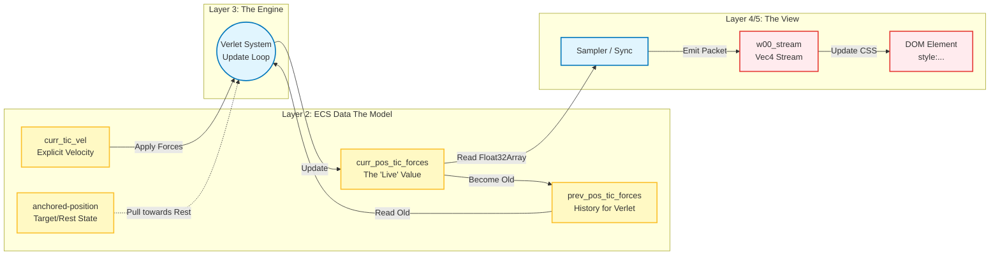

```mermaid
graph LR
    %% ---------------------------------------------------------
    %% STYLES
    %% ---------------------------------------------------------
    classDef storage fill:#fff9c4,stroke:#fbc02d,stroke-width:2px,color:#333;
    classDef system fill:#e1f5fe,stroke:#0277bd,stroke-width:2px,color:#333;
    classDef dom fill:#ffebee,stroke:#e53935,stroke-width:2px,color:#333;

    %% ---------------------------------------------------------
    %% ECS DATA (LAYER 2)
    %% ---------------------------------------------------------
    subgraph ECS [Layer 2: ECS Data The Model]
        direction TB
        AnchoredPos[anchored-position\nTarget/Rest State]:::storage
        CurrTic[curr_pos_tic_forces\nThe 'Live' Value]:::storage
        PrevTic[prev_pos_tic_forces\nHistory for Verlet]:::storage
        VelTic[curr_tic_vel\nExplicit Velocity]:::storage
    end

    %% ---------------------------------------------------------
    %% PHYSICS SYSTEM (LAYER 3)
    %% ---------------------------------------------------------
    subgraph Physics [Layer 3: The Engine]
        Integrator((Verlet System\nUpdate Loop)):::system
    end

    %% Physics Cycle
    VelTic -->|Apply Forces| Integrator
    PrevTic -->|Read Old| Integrator
    Integrator -->|Update| CurrTic
    CurrTic -->|Become Old| PrevTic

    %% The Anchor Constraint (Spring Force)
    AnchoredPos -.->|Pull towards Rest| Integrator

    %% ---------------------------------------------------------
    %% RENDER PIPELINE (LAYERS 4 & 5)
    %% ---------------------------------------------------------
    subgraph Render [Layer 4/5: The View]
        Sampler[Sampler / Sync]:::system
        Stream[w00_stream\nVec4 Stream]:::dom
        DOM[DOM Element\nstyle:...]:::dom
    end

    CurrTic -->|Read Float32Array| Sampler
    Sampler -->|Emit Packet| Stream
    Stream -->|Update CSS| DOM
```
