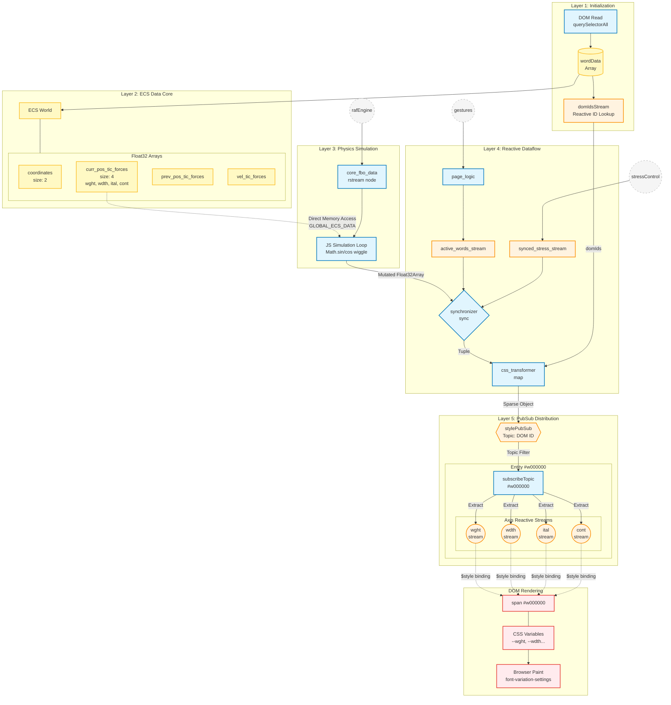

```mermaid
graph TD
    %% ---------------------------------------------------------
    %% STYLES
    %% ---------------------------------------------------------
    classDef storage fill:#fff9c4,stroke:#fbc02d,stroke-width:2px;
    classDef logic fill:#e1f5fe,stroke:#0277bd,stroke-width:2px;
    classDef stream fill:#fff3e0,stroke:#fb8c00,stroke-width:2px;
    classDef dom fill:#ffebee,stroke:#e53935,stroke-width:2px;
    classDef ext fill:#f5f5f5,stroke:#999,stroke-dasharray: 5 5;

    %% ---------------------------------------------------------
    %% EXTERNAL INPUTS
    %% ---------------------------------------------------------
    RAF((rafEngine)):::ext
    Gestures((gestures)):::ext
    Stress((stressControl)):::ext

    %% ---------------------------------------------------------
    %% LAYER 1: Initialization
    %% ---------------------------------------------------------
    subgraph L1 [Layer 1: Initialization]
        DOM_Read[DOM Read\nquerySelectorAll]:::logic
        WordData[(wordData\nArray<id, rect>)]:::storage
        DomIdsStream[domIdsStream\nReactive ID Lookup]:::stream
    end

    DOM_Read --> WordData
    WordData --> DomIdsStream

    %% ---------------------------------------------------------
    %% LAYER 2: ECS Data Core
    %% ---------------------------------------------------------
    subgraph L2 [Layer 2: ECS Data Core]
        ECS_World[ECS World]:::storage

        subgraph Components [Float32 Arrays]
            Coords[coordinates\nsize: 2]:::storage
            TicForces[curr_pos_tic_forces\nsize: 4\nwght, wdth, ital, cont]:::storage
            PrevTic[prev_pos_tic_forces]:::storage
            VelTic[vel_tic_forces]:::storage
        end
    end

    WordData --> ECS_World
    ECS_World --- Components

    %% ---------------------------------------------------------
    %% LAYER 3: Physics Engine
    %% ---------------------------------------------------------
    subgraph L3 [Layer 3: Physics Simulation]
        Core_FBO[core_fbo_data\nrstream node]:::logic
        Sim_Logic[JS Simulation Loop\nMath.sin/cos wiggle]:::logic
    end

    RAF --> Core_FBO
    TicForces -.->|Direct Memory Access\nGLOBAL_ECS_DATA| Sim_Logic
    Core_FBO --> Sim_Logic
    Sim_Logic -->|Mutated Float32Array| Synchronizer

    %% ---------------------------------------------------------
    %% LAYER 4: Synchronization
    %% ---------------------------------------------------------
    subgraph L4 [Layer 4: Reactive Dataflow]
        PageLogic[page_logic]:::logic
        ActiveWords[active_words_stream]:::stream
        SyncedStress[synced_stress_stream]:::stream

        Synchronizer{synchronizer\nsync}:::logic

        Transformer[css_transformer\nmap]:::logic
    end

    Gestures --> PageLogic --> ActiveWords
    Stress --> SyncedStress

    %% Inputs to Sync
    ActiveWords --> Synchronizer
    SyncedStress --> Synchronizer

    %% Transformer Wiring
    Synchronizer -->|Tuple| Transformer
    DomIdsStream -->|domIds| Transformer

    %% ---------------------------------------------------------
    %% LAYER 5: Distribution (THE NEW ARCHITECTURE)
    %% ---------------------------------------------------------
    subgraph L5 [Layer 5: PubSub Distribution]
        StylePubSub{{stylePubSub\nTopic: DOM ID}}:::stream

        subgraph Entity_00 [Entity #w000000]
            Sub_00[subscribeTopic\n#w000000]:::logic

            subgraph Axis_Streams [Axis Reactive Streams]
                S_Wght((wght\nstream)):::stream
                S_Wdth((wdth\nstream)):::stream
                S_Ital((ital\nstream)):::stream
                S_Cont((cont\nstream)):::stream
            end
        end
    end

    Transformer -->|Sparse Object| StylePubSub
    StylePubSub -->|Topic Filter| Sub_00

    Sub_00 -->|Extract| S_Wght
    Sub_00 -->|Extract| S_Wdth
    Sub_00 -->|Extract| S_Ital
    Sub_00 -->|Extract| S_Cont

    %% ---------------------------------------------------------
    %% DOM RENDERING rdom)
    %% ---------------------------------------------------------
    subgraph Render [DOM Rendering]
        Hiccup_Span[span #w000000]:::dom
        CSS_Vars[CSS Variables\n--wght, --wdth...]:::dom
        Browser_Paint[Browser Paint\nfont-variation-settings]:::dom
    end

    %% The $style binding
    S_Wght -.->|$style binding| Hiccup_Span
    S_Wdth -.->|$style binding| Hiccup_Span
    S_Ital -.->|$style binding| Hiccup_Span
    S_Cont -.->|$style binding| Hiccup_Span

    Hiccup_Span --- CSS_Vars
    CSS_Vars --> Browser_Paint
```
