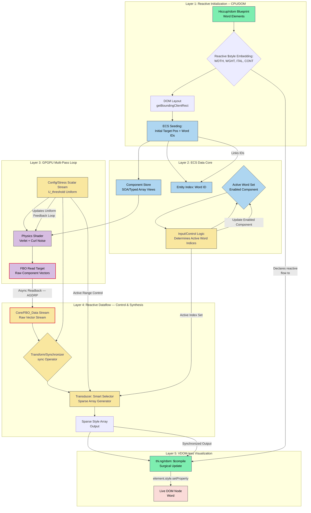

```mermaid
graph TD
    %% Global Styling
    classDef THING fill:#7deeb0,color:#000,stroke:#332d63;
    classDef DATA fill:#AED6F1,color:#000,stroke:#333;
    classDef PROCESS fill:#F9E79F,color:#332d63,stroke:#333;
    classDef GPU fill:#D7BDE2,color:#000,stroke:#333;
    classDef DOM fill:#FADBD8,color:#000,stroke:#333;
    classDef CRITICAL_LINK stroke-width:2px,stroke:#D90429;

    %% === LAYER 1: INITIALIZATION & SEEDING — CPU/DOM ===
    subgraph L1 [Layer 1: Reactive Initialization -- CPU/DOM]
        L1A[Hiccup/rdom Blueprint</br>Word Elements]:::THING
        L1B{Reactive $style Embedding:</br>WDTH, WGHT, ITAL, CONT};
        L1C[DOM Layout</br>getBoundingClientRect];
        L1D[ECS Seeding:</br>Initial Target Pos + Word IDs]:::DATA
        L1A --> L1B;
        L1B --> L1C;
        L1C --> L1D;
    end

    %% === LAYER 2: ECS DATA CORE — SOA/Typed Arrays ===
    subgraph L2 [Layer 2: ECS Data Core]
        L2A[Component Store</br>SOA/Typed Array Views]:::DATA
        L2B[Entity Index: Word ID]:::DATA
        L2C{Active Word Set</br>Enabled Component}:::DATA
        L1D --> L2A;
        L1D --> L2B;
        L4E --> L2C
    end

    %% === LAYER 3: GPGPU PHYSICS ENGINE — Parallel Execution ===
    subgraph L3 [Layer 3: GPGPU Multi-Pass Loop]
        L3A[Physics Shader</br>Verlet + Curl Noise]:::GPU
        L3B[FBO Read Target</br>Raw Component Vectors]:::GPU
        L2A --> L3A
        L4B --> L3A
        L3A --> L3B
    end

    %% === LAYER 4: REACTIVE DATAFLOW & ASYNC BRIDGE ===
    subgraph L4 [Layer 4: Reactive Dataflow — Control & Synthesis]
        L4A[Core/FBO_Data Stream</br>Raw Vector Stream]:::PROCESS
        L4B[Config/Stress Scalar Stream</br>U_threshold Uniform]:::PROCESS
        L4C{Transform/Synchronizer</br>sync Operator}:::PROCESS
        L4D[Transducer: Smart Selector</br>Sparse Array Generator]:::PROCESS
        L4E[Input/Control Logic</br>Determines Active Word Indices]:::PROCESS

        L3B -- Async Readback — AGDRP --> L4A;
        L4A --> L4C;
        L4B --> L4C;
        L4C --> L4D;
        L4D --> L4F[Sparse Style Array</br>Output];
        L4B -- Active Range Control --> L4D;
    end

    %% === LAYER 5: VDOM-LESS VISUALIZATION — CPU/DOM ===
    subgraph L5 [Layer 5: VDOM-less Visualization]
        L5A[thi.ng/rdom: $compile</br>Surgical Update]:::THING
        L5B[Live DOM Node</br>Word <span>]:::DOM
        L4F --> L5A;
        L5A -- element.style.setProperty --> L5B;
    end

    %% Cross-Layer Flow & Critical Edges
    L2C --> L4E
    L4E -- Active Index Set --> L4D
    L4F -- Synchronized Output --> L5A
    L1B -- Declares reactive</br>flow to --> L5A
    L1D -- Links IDs --> L2B
    L4B -- Updates Uniform</br>Feedback Loop --> L3A
    L4E -- Update Enabled Component --> L2C
    style L3B stroke:#D90429, stroke-width:2px;
    style L4A stroke:#D90429, stroke-width:2px;
```
