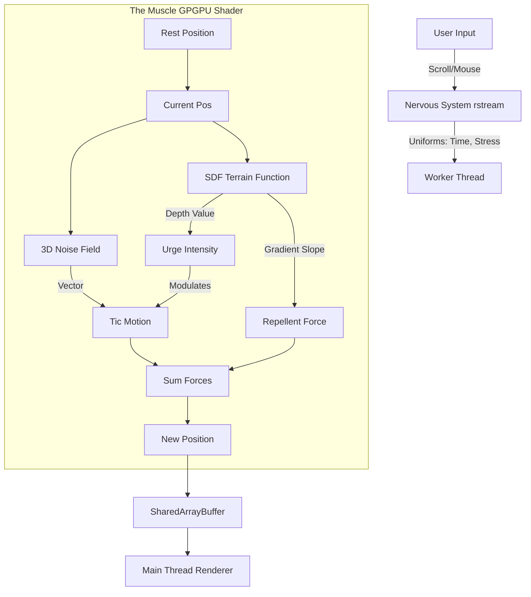

```mermaid
graph TD
    User[User Input] -->|Scroll/Mouse| Nervous[Nervous System rstream]
    Nervous -->|Uniforms: Time, Stress| Worker[Worker Thread]

    subgraph "The Muscle GPGPU Shader"
        Rest[Rest Position] --> Pos[Current Pos]

        Pos --> SDF[SDF Terrain Function]
        SDF -->|Gradient Slope| Repel[Repellent Force]
        SDF -->|Depth Value| Intensity[Urge Intensity]

        Pos --> Noise[3D Noise Field]
        Noise -->|Vector| Tic[Tic Motion]

        Intensity -->|Modulates| Tic

        Tic --> Sum[Sum Forces]
        Repel --> Sum

        Sum --> NewPos[New Position]
    end

    NewPos --> SAB[SharedArrayBuffer]
    SAB --> DOM[Main Thread Renderer]
```
