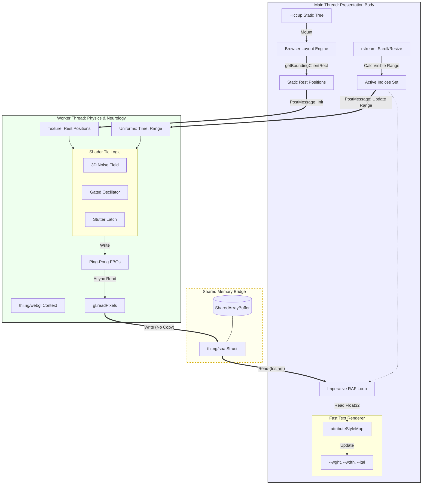

```mermaid
graph TD
    %% ---------------------------------------------------------
    %% LEFT HEMISPHERE: MAIN THREAD (UI & Render)
    %% ---------------------------------------------------------
    subgraph Main_Thread [Main Thread: Presentation Body]
        style Main_Thread fill:#eef,stroke:#333,stroke-width:2px

        DOM_Static[Hiccup Static Tree] -->|Mount| Layout_Engine[Browser Layout Engine]
        Layout_Engine -->|getBoundingClientRect| Rest_Pos[Static Rest Positions]

        Input_Scroll[rstream: Scroll/Resize] -->|Calc Visible Range| Active_Set[Active Indices Set]

        RAF_Loop[Imperative RAF Loop]
        Active_Set -.-> RAF_Loop

        subgraph Typed_OM [Fast Text Renderer]
            Attr_Map[attributeStyleMap]
            CSS_Vars[--wght, --wdth, --ital]
        end

        RAF_Loop -->|Read Float32| Attr_Map
        Attr_Map -->|Update| CSS_Vars
    end

    %% ---------------------------------------------------------
    %% CORPUS CALLOSUM: SHARED MEMORY BRIDGE
    %% ---------------------------------------------------------
    subgraph Shared_Memory [Shared Memory Bridge]
        style Shared_Memory fill:#ffe,stroke:#d4aa00,stroke-width:2px,stroke-dasharray: 5 5

        SAB[(SharedArrayBuffer)]
        SOA[thi.ng/soa Struct]

        SAB --- SOA
    end

    %% ---------------------------------------------------------
    %% RIGHT HEMISPHERE: WORKER THREAD (Physics Brain)
    %% ---------------------------------------------------------
    subgraph Worker_Thread [Worker Thread: Physics & Neurology]
        style Worker_Thread fill:#efe,stroke:#333,stroke-width:2px

        GPGPU_Ctx[thi.ng/webgl Context]

        subgraph Physics_Core [Shader Tic Logic]
            Noise_Field[3D Noise Field]
            Gated_Osc[Gated Oscillator]
            Tic_Latch[Stutter Latch]
        end

        Rest_Tex[Texture: Rest Positions] --> Physics_Core
        Uniforms[Uniforms: Time, Range] --> Physics_Core

        Physics_Core -->|Write| FBO_Ping[Ping-Pong FBOs]
        FBO_Ping -->|Async Read| Read_Pixels[gl.readPixels]
    end

    %% ---------------------------------------------------------
    %% DATA FLOW CONNECTIONS
    %% ---------------------------------------------------------

    %% Initialization
    Rest_Pos == PostMessage: Init ==> Rest_Tex

    %% Runtime Control (Main -> Worker)
    Active_Set == PostMessage: Update Range ==> Uniforms

    %% The Critical Loop
    Read_Pixels == Write (No Copy) ==> SOA
    SOA == Read (Instant) ==> RAF_Loop
```
