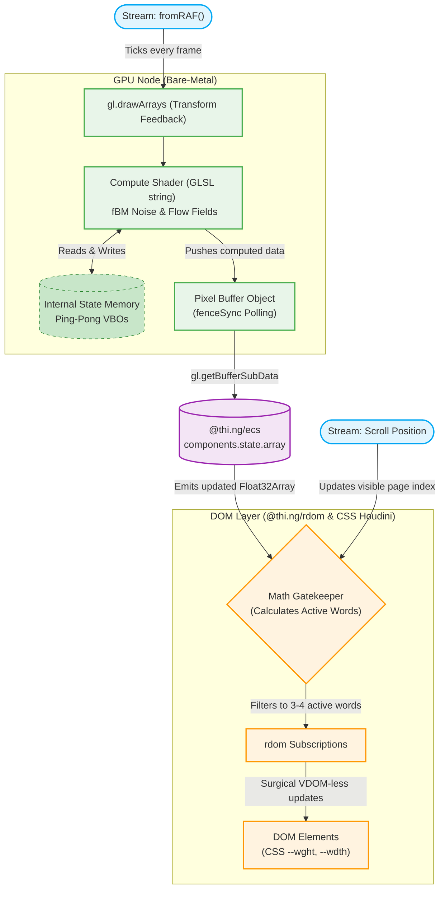

```mermaid
graph TD
    %% Define CSS classes for color-coding
    classDef stream fill:#e1f5fe,stroke:#03a9f4,stroke-width:2px;
    classDef gpu fill:#e8f5e9,stroke:#4caf50,stroke-width:2px;
    classDef internal fill:#c8e6c9,stroke:#388e3c,stroke-width:1px,stroke-dasharray: 5 5;
    classDef dom fill:#fff3e0,stroke:#ff9800,stroke-width:2px;
    classDef ecs fill:#f3e5f5,stroke:#9c27b0,stroke-width:2px;

    %% Source Streams (The top of the DAG)
    RAF(["Stream: fromRAF()"]):::stream
    Scroll(["Stream: Scroll Position"]):::stream

    %% The Transformer Node
    subgraph GPU_NODE ["GPU Node (Bare-Metal)"]
        direction TB
        Trigger["gl.drawArrays (Transform Feedback)"]:::gpu
        Shader["Compute Shader (GLSL string) <br/> fBM Noise & Flow Fields"]:::gpu
        VBO[("Internal State Memory <br/> Ping-Pong VBOs")]:::internal
        PBO["Pixel Buffer Object <br/> (fenceSync Polling)"]:::gpu

        Trigger --> Shader
        Shader <-->|Reads & Writes| VBO
        Shader -->|Pushes computed data| PBO
    end

    %% The State
    ECS[("@thi.ng/ecs<br/>components.state.array")]:::ecs

    %% The Sinks (UI Layer)
    subgraph UI_LAYER ["DOM Layer (@thi.ng/rdom & CSS Houdini)"]
        direction TB
        Gatekeeper{"Math Gatekeeper<br/>(Calculates Active Words)"}:::dom
        RDOM["rdom Subscriptions"]:::dom
        DOM["DOM <span> Elements <br/> (CSS --wght, --wdth)"]:::dom
    end

    %% DAG Connections
    RAF -->|Ticks every frame| Trigger
    PBO -->|gl.getBufferSubData| ECS
    ECS -->|Emits updated Float32Array| Gatekeeper
    Scroll -->|Updates visible page index| Gatekeeper
    Gatekeeper -->|Filters to 3-4 active words| RDOM
    RDOM -->|Surgical VDOM-less updates| DOM
```
